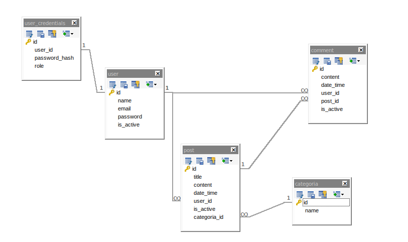

# EFI Final Python Integrantes:

. Bressan Nadal Franco Nicolas
 
. Leandro Odetto

## INSTRUCCIONES DE INSTALACION

    1. Clonar el repositorio
    2. Verificar si esta instalado uv ($ uv --version), si no larga un mensaje con la version debes instalarlo ($ pipx install uv).
    3. Instalar la paqueteria de pyproyect.tolm con (& uv sync).
    4. Verificar en app.py la conexion a la base de datos local. 
    6. Borrar carpeta migratios (si existe)
    7. Iniciar flask db ($ uv run flask db init) SOLO UNA VEZ
    8. Actualizar db ($ uv run flask db migrate)
    9. Aplicar cambios ($ uv run flask db upgrade)
    10 Iniciar servidor (& uv run flask run --reload)
    11. Abrir navegador y acceder a http://127.0.0.1:5000

## COMANDOS/EJECUCION

1. Iniciar servidor __uv run flask run --reload__

## DOCUMENTACION/ENDPOINTS

1. POST /api/register               # Registro cuentas (Publico)
        {
            "username": "user6",
            "email": "user6@gmail.com",
            "password": "user6123",
            "role": "user"
        }
2. POST /api/login                  # Autenth/loguearse (publico)
        {
            "email": "admin@gmail.com",
            "password":"admin123"
        }
3. GET  /api/posts                  # Ver posteos (Publico)

4. GET  /api/posts/<id>             # Ver posteo especifico (Publico)

5. POST /api/posts                  # Publicar post (User +)
        {
            "title": "Guía completa de Flask",
            "content": "En esta publicación explicamos",
            "categoria_id": 2
        }
6. PUT  /api/posts/<id>             # Editar post (Self o Admin)
        {
            "title": "Nuevo título actualizado",
            "content": "Este es el contenido modificado del post.",
            "category_id": 2
        }
7. DELETE /api/posts/<id>           # Borrado logico (Self o Admin)

8. GET /api/posts/<id>/comments     # Ver comment de un post (Publico)

9. POST /api/posts/<id>/comments    # Comentar Post (User+)
        {
            "content": "Comentario"
        }
10. DELETE /api/comments/<id>       # Borrado logico comments (Self, Mod, Admin)

11. GET /api/categories             # Ver categorias (Publico)

12. POST /api/categories            # Crear nuevas categorias (Mods y Admin)
        {
            "name": "deportes"
        }
13. PUT /api/categories/<id>        # Editar categorias (Mods y Admin)
        {
            "name": "educacion"
        }
14. DELETE /api/categories/<id>     # Borrar categorias (Admin)

15. GET /api/users                  # Ver todos los usuarios (Admin)

16. GET /api/users/<id>             # Ver usuario especifico (Self o Admin)

17. PUT /api/users/<id>             # Editar usuario (Self o Admin)
        {
            "username": "user7",
            "email": "user7@gmail.com",
            "password": "user7123",
            "role": "user"
        }
18. PATCH /api/users/<id>/role      # Cambiar rol (Admin)

19. DELETE /api/users/<id>          # Borrar usuaro (Admin)

20. GET /api/stats                  # ver estadisticas (mod) +last week (Admin)

## ESTRUCTURA

- **efiFInalPython**
    - assets/
    - models/
        - models.py
    - views/
        - views.py
        - user_views.py
        - stats_views.py
        - post_views.py
        - comments_views.py
        - categories_views.py
    - schemas/
        - schemas.py
    - repository
        - user_repository.py
        - stats_repository.py
        - post_repository.py
        - comment_repository.py
        - categorie_repository.py
    - services
        - user_services.py
        - stats_services.py
        - post_services.py
        - comment_services.py
        - categorie_services.py
    - cecorators/
        - decorators.py
    - app.py

## ESQUEMA Y RELACIONES BD

## COMENTARIOS INTERNOS DEL GRUPO
##### Generales
1. Creo esta seccion para la comunicacion del grupo si fuese necesario (recordar subir el README a main)
2. ~~Cambie la estructrura general del proyecto, ver de pasar los decorator a su propio archivo en carpeta raiz~~
3. Ahora el codigo esta comentado. __RECORDAR__ pulir el codigo
4. Nuevamente cambie la estructura del ptoyecto para incluir Arquitectura service-repository

###### UserDetailAPI
1. ~~Metodos GET, PUT, PATCH, DELETE funcionales~~
2. ~~**Falta** BORRADO LOGICO~~
3. PUT esta de mas, malinterprete la consigna, pero lo dejo
5. ~~__IMPORTANTE__ EN DELETE, BORRA DIRECTAMENTE LA FILA DE LA TABLA. VER IMPLEMENTAR BORRADO LOGICO~~
6. ~~**FALTA** mover de vievs a user_views~~
###### PostAPI
1. **FALTA** filtrado por categoria (logica armada en repository/service)  **LOGICA LISTA;  FALTAAAAAA,CREAR RUTA Y ARMAR VIEW NOMAS**  (no puedo probar por fre-trial en markdown)
2. Actualmente getpost trae todo incluido is_active false, para test (RECORDAR CAMBIAR SERVICE)
3. ~~falta implementar editar categoria~~ ~~se hace aparte, no en api/post~~

## AVANCES/CHECKLIST

- Creo esta seccion para controlar mas adelante que falta de la consigna

